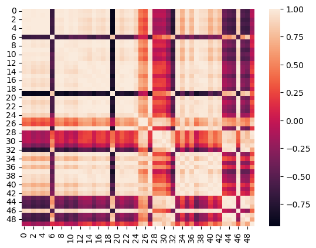
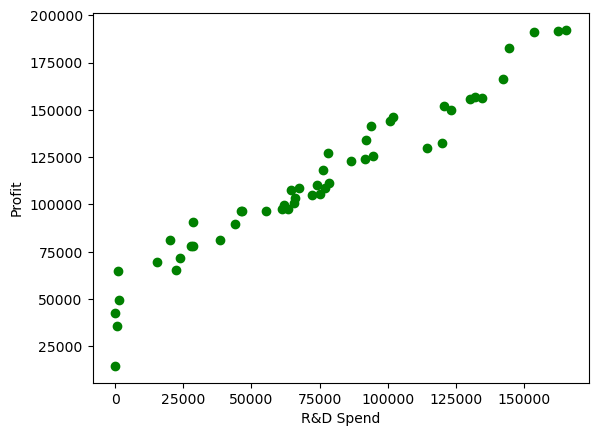
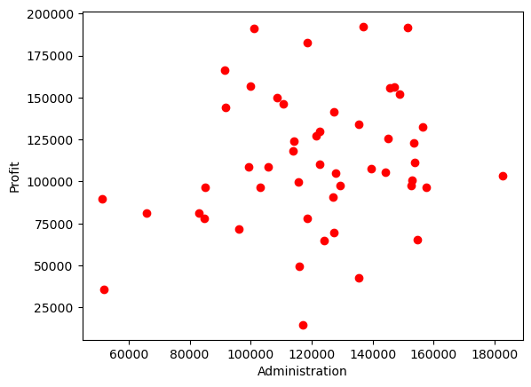
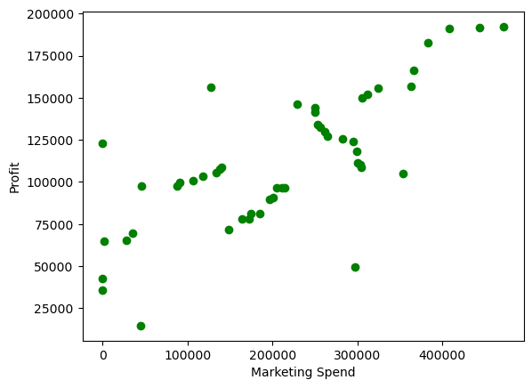

# Libraries


```python
import numpy as np
import pandas as pd
import matplotlib.pyplot as plt
import seaborn as sns
```

# Load Data


```python
data = pd.read_csv("50_Startups.csv")
```


```python
data.head()
```


<div>
<style scoped>
    .dataframe tbody tr th:only-of-type {
        vertical-align: middle;
    }

    .dataframe tbody tr th {
        vertical-align: top;
    }

    .dataframe thead th {
        text-align: right;
    }
</style>
<table border="1" class="dataframe">
  <thead>
    <tr style="text-align: right;">
      <th></th>
      <th>R&amp;D Spend</th>
      <th>Administration</th>
      <th>Marketing Spend</th>
      <th>State</th>
      <th>Profit</th>
    </tr>
  </thead>
  <tbody>
    <tr>
      <th>0</th>
      <td>165349.20</td>
      <td>136897.80</td>
      <td>471784.10</td>
      <td>New York</td>
      <td>192261.83</td>
    </tr>
    <tr>
      <th>1</th>
      <td>162597.70</td>
      <td>151377.59</td>
      <td>443898.53</td>
      <td>California</td>
      <td>191792.06</td>
    </tr>
    <tr>
      <th>2</th>
      <td>153441.51</td>
      <td>101145.55</td>
      <td>407934.54</td>
      <td>Florida</td>
      <td>191050.39</td>
    </tr>
    <tr>
      <th>3</th>
      <td>144372.41</td>
      <td>118671.85</td>
      <td>383199.62</td>
      <td>New York</td>
      <td>182901.99</td>
    </tr>
    <tr>
      <th>4</th>
      <td>142107.34</td>
      <td>91391.77</td>
      <td>366168.42</td>
      <td>Florida</td>
      <td>166187.94</td>
    </tr>
  </tbody>
</table>
</div>


# EDA


```python
data
```


<div>
<style scoped>
    .dataframe tbody tr th:only-of-type {
        vertical-align: middle;
    }

    .dataframe tbody tr th {
        vertical-align: top;
    }

    .dataframe thead th {
        text-align: right;
    }
</style>
<table border="1" class="dataframe">
  <thead>
    <tr style="text-align: right;">
      <th></th>
      <th>R&amp;D Spend</th>
      <th>Administration</th>
      <th>Marketing Spend</th>
      <th>State</th>
      <th>Profit</th>
    </tr>
  </thead>
  <tbody>
    <tr>
      <th>0</th>
      <td>165349.20</td>
      <td>136897.80</td>
      <td>471784.10</td>
      <td>New York</td>
      <td>192261.83</td>
    </tr>
    <tr>
      <th>1</th>
      <td>162597.70</td>
      <td>151377.59</td>
      <td>443898.53</td>
      <td>California</td>
      <td>191792.06</td>
    </tr>
    <tr>
      <th>2</th>
      <td>153441.51</td>
      <td>101145.55</td>
      <td>407934.54</td>
      <td>Florida</td>
      <td>191050.39</td>
    </tr>
    <tr>
      <th>3</th>
      <td>144372.41</td>
      <td>118671.85</td>
      <td>383199.62</td>
      <td>New York</td>
      <td>182901.99</td>
    </tr>
    <tr>
      <th>4</th>
      <td>142107.34</td>
      <td>91391.77</td>
      <td>366168.42</td>
      <td>Florida</td>
      <td>166187.94</td>
    </tr>
    <tr>
      <th>5</th>
      <td>131876.90</td>
      <td>99814.71</td>
      <td>362861.36</td>
      <td>New York</td>
      <td>156991.12</td>
    </tr>
    <tr>
      <th>6</th>
      <td>134615.46</td>
      <td>147198.87</td>
      <td>127716.82</td>
      <td>California</td>
      <td>156122.51</td>
    </tr>
    <tr>
      <th>7</th>
      <td>130298.13</td>
      <td>145530.06</td>
      <td>323876.68</td>
      <td>Florida</td>
      <td>155752.60</td>
    </tr>
    <tr>
      <th>8</th>
      <td>120542.52</td>
      <td>148718.95</td>
      <td>311613.29</td>
      <td>New York</td>
      <td>152211.77</td>
    </tr>
    <tr>
      <th>9</th>
      <td>123334.88</td>
      <td>108679.17</td>
      <td>304981.62</td>
      <td>California</td>
      <td>149759.96</td>
    </tr>
    <tr>
      <th>10</th>
      <td>101913.08</td>
      <td>110594.11</td>
      <td>229160.95</td>
      <td>Florida</td>
      <td>146121.95</td>
    </tr>
    <tr>
      <th>11</th>
      <td>100671.96</td>
      <td>91790.61</td>
      <td>249744.55</td>
      <td>California</td>
      <td>144259.40</td>
    </tr>
    <tr>
      <th>12</th>
      <td>93863.75</td>
      <td>127320.38</td>
      <td>249839.44</td>
      <td>Florida</td>
      <td>141585.52</td>
    </tr>
    <tr>
      <th>13</th>
      <td>91992.39</td>
      <td>135495.07</td>
      <td>252664.93</td>
      <td>California</td>
      <td>134307.35</td>
    </tr>
    <tr>
      <th>14</th>
      <td>119943.24</td>
      <td>156547.42</td>
      <td>256512.92</td>
      <td>Florida</td>
      <td>132602.65</td>
    </tr>
    <tr>
      <th>15</th>
      <td>114523.61</td>
      <td>122616.84</td>
      <td>261776.23</td>
      <td>New York</td>
      <td>129917.04</td>
    </tr>
    <tr>
      <th>16</th>
      <td>78013.11</td>
      <td>121597.55</td>
      <td>264346.06</td>
      <td>California</td>
      <td>126992.93</td>
    </tr>
    <tr>
      <th>17</th>
      <td>94657.16</td>
      <td>145077.58</td>
      <td>282574.31</td>
      <td>New York</td>
      <td>125370.37</td>
    </tr>
    <tr>
      <th>18</th>
      <td>91749.16</td>
      <td>114175.79</td>
      <td>294919.57</td>
      <td>Florida</td>
      <td>124266.90</td>
    </tr>
    <tr>
      <th>19</th>
      <td>86419.70</td>
      <td>153514.11</td>
      <td>0.00</td>
      <td>New York</td>
      <td>122776.86</td>
    </tr>
    <tr>
      <th>20</th>
      <td>76253.86</td>
      <td>113867.30</td>
      <td>298664.47</td>
      <td>California</td>
      <td>118474.03</td>
    </tr>
    <tr>
      <th>21</th>
      <td>78389.47</td>
      <td>153773.43</td>
      <td>299737.29</td>
      <td>New York</td>
      <td>111313.02</td>
    </tr>
    <tr>
      <th>22</th>
      <td>73994.56</td>
      <td>122782.75</td>
      <td>303319.26</td>
      <td>Florida</td>
      <td>110352.25</td>
    </tr>
    <tr>
      <th>23</th>
      <td>67532.53</td>
      <td>105751.03</td>
      <td>304768.73</td>
      <td>Florida</td>
      <td>108733.99</td>
    </tr>
    <tr>
      <th>24</th>
      <td>77044.01</td>
      <td>99281.34</td>
      <td>140574.81</td>
      <td>New York</td>
      <td>108552.04</td>
    </tr>
    <tr>
      <th>25</th>
      <td>64664.71</td>
      <td>139553.16</td>
      <td>137962.62</td>
      <td>California</td>
      <td>107404.34</td>
    </tr>
    <tr>
      <th>26</th>
      <td>75328.87</td>
      <td>144135.98</td>
      <td>134050.07</td>
      <td>Florida</td>
      <td>105733.54</td>
    </tr>
    <tr>
      <th>27</th>
      <td>72107.60</td>
      <td>127864.55</td>
      <td>353183.81</td>
      <td>New York</td>
      <td>105008.31</td>
    </tr>
    <tr>
      <th>28</th>
      <td>66051.52</td>
      <td>182645.56</td>
      <td>118148.20</td>
      <td>Florida</td>
      <td>103282.38</td>
    </tr>
    <tr>
      <th>29</th>
      <td>65605.48</td>
      <td>153032.06</td>
      <td>107138.38</td>
      <td>New York</td>
      <td>101004.64</td>
    </tr>
    <tr>
      <th>30</th>
      <td>61994.48</td>
      <td>115641.28</td>
      <td>91131.24</td>
      <td>Florida</td>
      <td>99937.59</td>
    </tr>
    <tr>
      <th>31</th>
      <td>61136.38</td>
      <td>152701.92</td>
      <td>88218.23</td>
      <td>New York</td>
      <td>97483.56</td>
    </tr>
    <tr>
      <th>32</th>
      <td>63408.86</td>
      <td>129219.61</td>
      <td>46085.25</td>
      <td>California</td>
      <td>97427.84</td>
    </tr>
    <tr>
      <th>33</th>
      <td>55493.95</td>
      <td>103057.49</td>
      <td>214634.81</td>
      <td>Florida</td>
      <td>96778.92</td>
    </tr>
    <tr>
      <th>34</th>
      <td>46426.07</td>
      <td>157693.92</td>
      <td>210797.67</td>
      <td>California</td>
      <td>96712.80</td>
    </tr>
    <tr>
      <th>35</th>
      <td>46014.02</td>
      <td>85047.44</td>
      <td>205517.64</td>
      <td>New York</td>
      <td>96479.51</td>
    </tr>
    <tr>
      <th>36</th>
      <td>28663.76</td>
      <td>127056.21</td>
      <td>201126.82</td>
      <td>Florida</td>
      <td>90708.19</td>
    </tr>
    <tr>
      <th>37</th>
      <td>44069.95</td>
      <td>51283.14</td>
      <td>197029.42</td>
      <td>California</td>
      <td>89949.14</td>
    </tr>
    <tr>
      <th>38</th>
      <td>20229.59</td>
      <td>65947.93</td>
      <td>185265.10</td>
      <td>New York</td>
      <td>81229.06</td>
    </tr>
    <tr>
      <th>39</th>
      <td>38558.51</td>
      <td>82982.09</td>
      <td>174999.30</td>
      <td>California</td>
      <td>81005.76</td>
    </tr>
    <tr>
      <th>40</th>
      <td>28754.33</td>
      <td>118546.05</td>
      <td>172795.67</td>
      <td>California</td>
      <td>78239.91</td>
    </tr>
    <tr>
      <th>41</th>
      <td>27892.92</td>
      <td>84710.77</td>
      <td>164470.71</td>
      <td>Florida</td>
      <td>77798.83</td>
    </tr>
    <tr>
      <th>42</th>
      <td>23640.93</td>
      <td>96189.63</td>
      <td>148001.11</td>
      <td>California</td>
      <td>71498.49</td>
    </tr>
    <tr>
      <th>43</th>
      <td>15505.73</td>
      <td>127382.30</td>
      <td>35534.17</td>
      <td>New York</td>
      <td>69758.98</td>
    </tr>
    <tr>
      <th>44</th>
      <td>22177.74</td>
      <td>154806.14</td>
      <td>28334.72</td>
      <td>California</td>
      <td>65200.33</td>
    </tr>
    <tr>
      <th>45</th>
      <td>1000.23</td>
      <td>124153.04</td>
      <td>1903.93</td>
      <td>New York</td>
      <td>64926.08</td>
    </tr>
    <tr>
      <th>46</th>
      <td>1315.46</td>
      <td>115816.21</td>
      <td>297114.46</td>
      <td>Florida</td>
      <td>49490.75</td>
    </tr>
    <tr>
      <th>47</th>
      <td>0.00</td>
      <td>135426.92</td>
      <td>0.00</td>
      <td>California</td>
      <td>42559.73</td>
    </tr>
    <tr>
      <th>48</th>
      <td>542.05</td>
      <td>51743.15</td>
      <td>0.00</td>
      <td>New York</td>
      <td>35673.41</td>
    </tr>
    <tr>
      <th>49</th>
      <td>0.00</td>
      <td>116983.80</td>
      <td>45173.06</td>
      <td>California</td>
      <td>14681.40</td>
    </tr>
  </tbody>
</table>
</div>


```python
data = data.drop(["State"] , axis=1)
```


```python
data
```


<div>
<style scoped>
    .dataframe tbody tr th:only-of-type {
        vertical-align: middle;
    }

    .dataframe tbody tr th {
        vertical-align: top;
    }

    .dataframe thead th {
        text-align: right;
    }
</style>
<table border="1" class="dataframe">
  <thead>
    <tr style="text-align: right;">
      <th></th>
      <th>R&amp;D Spend</th>
      <th>Administration</th>
      <th>Marketing Spend</th>
      <th>Profit</th>
    </tr>
  </thead>
  <tbody>
    <tr>
      <th>0</th>
      <td>165349.20</td>
      <td>136897.80</td>
      <td>471784.10</td>
      <td>192261.83</td>
    </tr>
    <tr>
      <th>1</th>
      <td>162597.70</td>
      <td>151377.59</td>
      <td>443898.53</td>
      <td>191792.06</td>
    </tr>
    <tr>
      <th>2</th>
      <td>153441.51</td>
      <td>101145.55</td>
      <td>407934.54</td>
      <td>191050.39</td>
    </tr>
    <tr>
      <th>3</th>
      <td>144372.41</td>
      <td>118671.85</td>
      <td>383199.62</td>
      <td>182901.99</td>
    </tr>
    <tr>
      <th>4</th>
      <td>142107.34</td>
      <td>91391.77</td>
      <td>366168.42</td>
      <td>166187.94</td>
    </tr>
    <tr>
      <th>5</th>
      <td>131876.90</td>
      <td>99814.71</td>
      <td>362861.36</td>
      <td>156991.12</td>
    </tr>
    <tr>
      <th>6</th>
      <td>134615.46</td>
      <td>147198.87</td>
      <td>127716.82</td>
      <td>156122.51</td>
    </tr>
    <tr>
      <th>7</th>
      <td>130298.13</td>
      <td>145530.06</td>
      <td>323876.68</td>
      <td>155752.60</td>
    </tr>
    <tr>
      <th>8</th>
      <td>120542.52</td>
      <td>148718.95</td>
      <td>311613.29</td>
      <td>152211.77</td>
    </tr>
    <tr>
      <th>9</th>
      <td>123334.88</td>
      <td>108679.17</td>
      <td>304981.62</td>
      <td>149759.96</td>
    </tr>
    <tr>
      <th>10</th>
      <td>101913.08</td>
      <td>110594.11</td>
      <td>229160.95</td>
      <td>146121.95</td>
    </tr>
    <tr>
      <th>11</th>
      <td>100671.96</td>
      <td>91790.61</td>
      <td>249744.55</td>
      <td>144259.40</td>
    </tr>
    <tr>
      <th>12</th>
      <td>93863.75</td>
      <td>127320.38</td>
      <td>249839.44</td>
      <td>141585.52</td>
    </tr>
    <tr>
      <th>13</th>
      <td>91992.39</td>
      <td>135495.07</td>
      <td>252664.93</td>
      <td>134307.35</td>
    </tr>
    <tr>
      <th>14</th>
      <td>119943.24</td>
      <td>156547.42</td>
      <td>256512.92</td>
      <td>132602.65</td>
    </tr>
    <tr>
      <th>15</th>
      <td>114523.61</td>
      <td>122616.84</td>
      <td>261776.23</td>
      <td>129917.04</td>
    </tr>
    <tr>
      <th>16</th>
      <td>78013.11</td>
      <td>121597.55</td>
      <td>264346.06</td>
      <td>126992.93</td>
    </tr>
    <tr>
      <th>17</th>
      <td>94657.16</td>
      <td>145077.58</td>
      <td>282574.31</td>
      <td>125370.37</td>
    </tr>
    <tr>
      <th>18</th>
      <td>91749.16</td>
      <td>114175.79</td>
      <td>294919.57</td>
      <td>124266.90</td>
    </tr>
    <tr>
      <th>19</th>
      <td>86419.70</td>
      <td>153514.11</td>
      <td>0.00</td>
      <td>122776.86</td>
    </tr>
    <tr>
      <th>20</th>
      <td>76253.86</td>
      <td>113867.30</td>
      <td>298664.47</td>
      <td>118474.03</td>
    </tr>
    <tr>
      <th>21</th>
      <td>78389.47</td>
      <td>153773.43</td>
      <td>299737.29</td>
      <td>111313.02</td>
    </tr>
    <tr>
      <th>22</th>
      <td>73994.56</td>
      <td>122782.75</td>
      <td>303319.26</td>
      <td>110352.25</td>
    </tr>
    <tr>
      <th>23</th>
      <td>67532.53</td>
      <td>105751.03</td>
      <td>304768.73</td>
      <td>108733.99</td>
    </tr>
    <tr>
      <th>24</th>
      <td>77044.01</td>
      <td>99281.34</td>
      <td>140574.81</td>
      <td>108552.04</td>
    </tr>
    <tr>
      <th>25</th>
      <td>64664.71</td>
      <td>139553.16</td>
      <td>137962.62</td>
      <td>107404.34</td>
    </tr>
    <tr>
      <th>26</th>
      <td>75328.87</td>
      <td>144135.98</td>
      <td>134050.07</td>
      <td>105733.54</td>
    </tr>
    <tr>
      <th>27</th>
      <td>72107.60</td>
      <td>127864.55</td>
      <td>353183.81</td>
      <td>105008.31</td>
    </tr>
    <tr>
      <th>28</th>
      <td>66051.52</td>
      <td>182645.56</td>
      <td>118148.20</td>
      <td>103282.38</td>
    </tr>
    <tr>
      <th>29</th>
      <td>65605.48</td>
      <td>153032.06</td>
      <td>107138.38</td>
      <td>101004.64</td>
    </tr>
    <tr>
      <th>30</th>
      <td>61994.48</td>
      <td>115641.28</td>
      <td>91131.24</td>
      <td>99937.59</td>
    </tr>
    <tr>
      <th>31</th>
      <td>61136.38</td>
      <td>152701.92</td>
      <td>88218.23</td>
      <td>97483.56</td>
    </tr>
    <tr>
      <th>32</th>
      <td>63408.86</td>
      <td>129219.61</td>
      <td>46085.25</td>
      <td>97427.84</td>
    </tr>
    <tr>
      <th>33</th>
      <td>55493.95</td>
      <td>103057.49</td>
      <td>214634.81</td>
      <td>96778.92</td>
    </tr>
    <tr>
      <th>34</th>
      <td>46426.07</td>
      <td>157693.92</td>
      <td>210797.67</td>
      <td>96712.80</td>
    </tr>
    <tr>
      <th>35</th>
      <td>46014.02</td>
      <td>85047.44</td>
      <td>205517.64</td>
      <td>96479.51</td>
    </tr>
    <tr>
      <th>36</th>
      <td>28663.76</td>
      <td>127056.21</td>
      <td>201126.82</td>
      <td>90708.19</td>
    </tr>
    <tr>
      <th>37</th>
      <td>44069.95</td>
      <td>51283.14</td>
      <td>197029.42</td>
      <td>89949.14</td>
    </tr>
    <tr>
      <th>38</th>
      <td>20229.59</td>
      <td>65947.93</td>
      <td>185265.10</td>
      <td>81229.06</td>
    </tr>
    <tr>
      <th>39</th>
      <td>38558.51</td>
      <td>82982.09</td>
      <td>174999.30</td>
      <td>81005.76</td>
    </tr>
    <tr>
      <th>40</th>
      <td>28754.33</td>
      <td>118546.05</td>
      <td>172795.67</td>
      <td>78239.91</td>
    </tr>
    <tr>
      <th>41</th>
      <td>27892.92</td>
      <td>84710.77</td>
      <td>164470.71</td>
      <td>77798.83</td>
    </tr>
    <tr>
      <th>42</th>
      <td>23640.93</td>
      <td>96189.63</td>
      <td>148001.11</td>
      <td>71498.49</td>
    </tr>
    <tr>
      <th>43</th>
      <td>15505.73</td>
      <td>127382.30</td>
      <td>35534.17</td>
      <td>69758.98</td>
    </tr>
    <tr>
      <th>44</th>
      <td>22177.74</td>
      <td>154806.14</td>
      <td>28334.72</td>
      <td>65200.33</td>
    </tr>
    <tr>
      <th>45</th>
      <td>1000.23</td>
      <td>124153.04</td>
      <td>1903.93</td>
      <td>64926.08</td>
    </tr>
    <tr>
      <th>46</th>
      <td>1315.46</td>
      <td>115816.21</td>
      <td>297114.46</td>
      <td>49490.75</td>
    </tr>
    <tr>
      <th>47</th>
      <td>0.00</td>
      <td>135426.92</td>
      <td>0.00</td>
      <td>42559.73</td>
    </tr>
    <tr>
      <th>48</th>
      <td>542.05</td>
      <td>51743.15</td>
      <td>0.00</td>
      <td>35673.41</td>
    </tr>
    <tr>
      <th>49</th>
      <td>0.00</td>
      <td>116983.80</td>
      <td>45173.06</td>
      <td>14681.40</td>
    </tr>
  </tbody>
</table>
</div>


```python
correlation_coef =  np.corrcoef(data)
```


```python
correlation_coef
```


    array([[ 1.        ,  0.99909686,  0.99134819, ..., -0.54765259,
            -0.59817572, -0.10612104],
           [ 0.99909686,  1.        ,  0.98620853, ..., -0.51161011,
            -0.56735113, -0.06500481],
           [ 0.99134819,  0.98620853,  1.        , ..., -0.62535898,
            -0.63299852, -0.22192014],
           ...,
           [-0.54765259, -0.51161011, -0.62535898, ...,  1.        ,
             0.92868976,  0.86262957],
           [-0.59817572, -0.56735113, -0.63299852, ...,  0.92868976,
             1.        ,  0.66427204],
           [-0.10612104, -0.06500481, -0.22192014, ...,  0.86262957,
             0.66427204,  1.        ]])


```python
sns.heatmap(correlation_coef)
plt.show()
```


    

    


```python
data.corr()
```


<div>
<style scoped>
    .dataframe tbody tr th:only-of-type {
        vertical-align: middle;
    }

    .dataframe tbody tr th {
        vertical-align: top;
    }

    .dataframe thead th {
        text-align: right;
    }
</style>
<table border="1" class="dataframe">
  <thead>
    <tr style="text-align: right;">
      <th></th>
      <th>R&amp;D Spend</th>
      <th>Administration</th>
      <th>Marketing Spend</th>
      <th>Profit</th>
    </tr>
  </thead>
  <tbody>
    <tr>
      <th>R&amp;D Spend</th>
      <td>1.000000</td>
      <td>0.241955</td>
      <td>0.724248</td>
      <td>0.972900</td>
    </tr>
    <tr>
      <th>Administration</th>
      <td>0.241955</td>
      <td>1.000000</td>
      <td>-0.032154</td>
      <td>0.200717</td>
    </tr>
    <tr>
      <th>Marketing Spend</th>
      <td>0.724248</td>
      <td>-0.032154</td>
      <td>1.000000</td>
      <td>0.747766</td>
    </tr>
    <tr>
      <th>Profit</th>
      <td>0.972900</td>
      <td>0.200717</td>
      <td>0.747766</td>
      <td>1.000000</td>
    </tr>
  </tbody>
</table>
</div>


```python
plt.scatter(data['R&D Spend'] , data['Profit'] , color='g')
plt.xlabel('R&D Spend')
plt.ylabel('Profit')
plt.show()
```


    

    


```python
plt.scatter(data['Administration'] , data['Profit'] , color='r')
plt.xlabel('Administration')
plt.ylabel('Profit')
plt.show()
```


    

    


```python
plt.scatter(data['Marketing Spend'] , data['Profit'] , color = 'g')
plt.xlabel('Marketing Spend')
plt.ylabel('Profit')
plt.show()
```


    

    


- Have a good Linear Relation Between RD Spend and Profit

- Have a bad relation Between adminstration and Profit

- Have a relation between Marketing Spend and Profit but it's not very good

Drop Administration columns to avoid misleading our Model


```python
data = data.drop(["Administration"] , axis=1)
```


```python
data
```


<div>
<style scoped>
    .dataframe tbody tr th:only-of-type {
        vertical-align: middle;
    }

    .dataframe tbody tr th {
        vertical-align: top;
    }

    .dataframe thead th {
        text-align: right;
    }
</style>
<table border="1" class="dataframe">
  <thead>
    <tr style="text-align: right;">
      <th></th>
      <th>R&amp;D Spend</th>
      <th>Marketing Spend</th>
      <th>Profit</th>
    </tr>
  </thead>
  <tbody>
    <tr>
      <th>0</th>
      <td>165349.20</td>
      <td>471784.10</td>
      <td>192261.83</td>
    </tr>
    <tr>
      <th>1</th>
      <td>162597.70</td>
      <td>443898.53</td>
      <td>191792.06</td>
    </tr>
    <tr>
      <th>2</th>
      <td>153441.51</td>
      <td>407934.54</td>
      <td>191050.39</td>
    </tr>
    <tr>
      <th>3</th>
      <td>144372.41</td>
      <td>383199.62</td>
      <td>182901.99</td>
    </tr>
    <tr>
      <th>4</th>
      <td>142107.34</td>
      <td>366168.42</td>
      <td>166187.94</td>
    </tr>
    <tr>
      <th>5</th>
      <td>131876.90</td>
      <td>362861.36</td>
      <td>156991.12</td>
    </tr>
    <tr>
      <th>6</th>
      <td>134615.46</td>
      <td>127716.82</td>
      <td>156122.51</td>
    </tr>
    <tr>
      <th>7</th>
      <td>130298.13</td>
      <td>323876.68</td>
      <td>155752.60</td>
    </tr>
    <tr>
      <th>8</th>
      <td>120542.52</td>
      <td>311613.29</td>
      <td>152211.77</td>
    </tr>
    <tr>
      <th>9</th>
      <td>123334.88</td>
      <td>304981.62</td>
      <td>149759.96</td>
    </tr>
    <tr>
      <th>10</th>
      <td>101913.08</td>
      <td>229160.95</td>
      <td>146121.95</td>
    </tr>
    <tr>
      <th>11</th>
      <td>100671.96</td>
      <td>249744.55</td>
      <td>144259.40</td>
    </tr>
    <tr>
      <th>12</th>
      <td>93863.75</td>
      <td>249839.44</td>
      <td>141585.52</td>
    </tr>
    <tr>
      <th>13</th>
      <td>91992.39</td>
      <td>252664.93</td>
      <td>134307.35</td>
    </tr>
    <tr>
      <th>14</th>
      <td>119943.24</td>
      <td>256512.92</td>
      <td>132602.65</td>
    </tr>
    <tr>
      <th>15</th>
      <td>114523.61</td>
      <td>261776.23</td>
      <td>129917.04</td>
    </tr>
    <tr>
      <th>16</th>
      <td>78013.11</td>
      <td>264346.06</td>
      <td>126992.93</td>
    </tr>
    <tr>
      <th>17</th>
      <td>94657.16</td>
      <td>282574.31</td>
      <td>125370.37</td>
    </tr>
    <tr>
      <th>18</th>
      <td>91749.16</td>
      <td>294919.57</td>
      <td>124266.90</td>
    </tr>
    <tr>
      <th>19</th>
      <td>86419.70</td>
      <td>0.00</td>
      <td>122776.86</td>
    </tr>
    <tr>
      <th>20</th>
      <td>76253.86</td>
      <td>298664.47</td>
      <td>118474.03</td>
    </tr>
    <tr>
      <th>21</th>
      <td>78389.47</td>
      <td>299737.29</td>
      <td>111313.02</td>
    </tr>
    <tr>
      <th>22</th>
      <td>73994.56</td>
      <td>303319.26</td>
      <td>110352.25</td>
    </tr>
    <tr>
      <th>23</th>
      <td>67532.53</td>
      <td>304768.73</td>
      <td>108733.99</td>
    </tr>
    <tr>
      <th>24</th>
      <td>77044.01</td>
      <td>140574.81</td>
      <td>108552.04</td>
    </tr>
    <tr>
      <th>25</th>
      <td>64664.71</td>
      <td>137962.62</td>
      <td>107404.34</td>
    </tr>
    <tr>
      <th>26</th>
      <td>75328.87</td>
      <td>134050.07</td>
      <td>105733.54</td>
    </tr>
    <tr>
      <th>27</th>
      <td>72107.60</td>
      <td>353183.81</td>
      <td>105008.31</td>
    </tr>
    <tr>
      <th>28</th>
      <td>66051.52</td>
      <td>118148.20</td>
      <td>103282.38</td>
    </tr>
    <tr>
      <th>29</th>
      <td>65605.48</td>
      <td>107138.38</td>
      <td>101004.64</td>
    </tr>
    <tr>
      <th>30</th>
      <td>61994.48</td>
      <td>91131.24</td>
      <td>99937.59</td>
    </tr>
    <tr>
      <th>31</th>
      <td>61136.38</td>
      <td>88218.23</td>
      <td>97483.56</td>
    </tr>
    <tr>
      <th>32</th>
      <td>63408.86</td>
      <td>46085.25</td>
      <td>97427.84</td>
    </tr>
    <tr>
      <th>33</th>
      <td>55493.95</td>
      <td>214634.81</td>
      <td>96778.92</td>
    </tr>
    <tr>
      <th>34</th>
      <td>46426.07</td>
      <td>210797.67</td>
      <td>96712.80</td>
    </tr>
    <tr>
      <th>35</th>
      <td>46014.02</td>
      <td>205517.64</td>
      <td>96479.51</td>
    </tr>
    <tr>
      <th>36</th>
      <td>28663.76</td>
      <td>201126.82</td>
      <td>90708.19</td>
    </tr>
    <tr>
      <th>37</th>
      <td>44069.95</td>
      <td>197029.42</td>
      <td>89949.14</td>
    </tr>
    <tr>
      <th>38</th>
      <td>20229.59</td>
      <td>185265.10</td>
      <td>81229.06</td>
    </tr>
    <tr>
      <th>39</th>
      <td>38558.51</td>
      <td>174999.30</td>
      <td>81005.76</td>
    </tr>
    <tr>
      <th>40</th>
      <td>28754.33</td>
      <td>172795.67</td>
      <td>78239.91</td>
    </tr>
    <tr>
      <th>41</th>
      <td>27892.92</td>
      <td>164470.71</td>
      <td>77798.83</td>
    </tr>
    <tr>
      <th>42</th>
      <td>23640.93</td>
      <td>148001.11</td>
      <td>71498.49</td>
    </tr>
    <tr>
      <th>43</th>
      <td>15505.73</td>
      <td>35534.17</td>
      <td>69758.98</td>
    </tr>
    <tr>
      <th>44</th>
      <td>22177.74</td>
      <td>28334.72</td>
      <td>65200.33</td>
    </tr>
    <tr>
      <th>45</th>
      <td>1000.23</td>
      <td>1903.93</td>
      <td>64926.08</td>
    </tr>
    <tr>
      <th>46</th>
      <td>1315.46</td>
      <td>297114.46</td>
      <td>49490.75</td>
    </tr>
    <tr>
      <th>47</th>
      <td>0.00</td>
      <td>0.00</td>
      <td>42559.73</td>
    </tr>
    <tr>
      <th>48</th>
      <td>542.05</td>
      <td>0.00</td>
      <td>35673.41</td>
    </tr>
    <tr>
      <th>49</th>
      <td>0.00</td>
      <td>45173.06</td>
      <td>14681.40</td>
    </tr>
  </tbody>
</table>
</div>


```python
features  = data.iloc[: , :2]
```


```python
features
```


<div>
<style scoped>
    .dataframe tbody tr th:only-of-type {
        vertical-align: middle;
    }

    .dataframe tbody tr th {
        vertical-align: top;
    }

    .dataframe thead th {
        text-align: right;
    }
</style>
<table border="1" class="dataframe">
  <thead>
    <tr style="text-align: right;">
      <th></th>
      <th>R&amp;D Spend</th>
      <th>Marketing Spend</th>
    </tr>
  </thead>
  <tbody>
    <tr>
      <th>0</th>
      <td>165349.20</td>
      <td>471784.10</td>
    </tr>
    <tr>
      <th>1</th>
      <td>162597.70</td>
      <td>443898.53</td>
    </tr>
    <tr>
      <th>2</th>
      <td>153441.51</td>
      <td>407934.54</td>
    </tr>
    <tr>
      <th>3</th>
      <td>144372.41</td>
      <td>383199.62</td>
    </tr>
    <tr>
      <th>4</th>
      <td>142107.34</td>
      <td>366168.42</td>
    </tr>
    <tr>
      <th>5</th>
      <td>131876.90</td>
      <td>362861.36</td>
    </tr>
    <tr>
      <th>6</th>
      <td>134615.46</td>
      <td>127716.82</td>
    </tr>
    <tr>
      <th>7</th>
      <td>130298.13</td>
      <td>323876.68</td>
    </tr>
    <tr>
      <th>8</th>
      <td>120542.52</td>
      <td>311613.29</td>
    </tr>
    <tr>
      <th>9</th>
      <td>123334.88</td>
      <td>304981.62</td>
    </tr>
    <tr>
      <th>10</th>
      <td>101913.08</td>
      <td>229160.95</td>
    </tr>
    <tr>
      <th>11</th>
      <td>100671.96</td>
      <td>249744.55</td>
    </tr>
    <tr>
      <th>12</th>
      <td>93863.75</td>
      <td>249839.44</td>
    </tr>
    <tr>
      <th>13</th>
      <td>91992.39</td>
      <td>252664.93</td>
    </tr>
    <tr>
      <th>14</th>
      <td>119943.24</td>
      <td>256512.92</td>
    </tr>
    <tr>
      <th>15</th>
      <td>114523.61</td>
      <td>261776.23</td>
    </tr>
    <tr>
      <th>16</th>
      <td>78013.11</td>
      <td>264346.06</td>
    </tr>
    <tr>
      <th>17</th>
      <td>94657.16</td>
      <td>282574.31</td>
    </tr>
    <tr>
      <th>18</th>
      <td>91749.16</td>
      <td>294919.57</td>
    </tr>
    <tr>
      <th>19</th>
      <td>86419.70</td>
      <td>0.00</td>
    </tr>
    <tr>
      <th>20</th>
      <td>76253.86</td>
      <td>298664.47</td>
    </tr>
    <tr>
      <th>21</th>
      <td>78389.47</td>
      <td>299737.29</td>
    </tr>
    <tr>
      <th>22</th>
      <td>73994.56</td>
      <td>303319.26</td>
    </tr>
    <tr>
      <th>23</th>
      <td>67532.53</td>
      <td>304768.73</td>
    </tr>
    <tr>
      <th>24</th>
      <td>77044.01</td>
      <td>140574.81</td>
    </tr>
    <tr>
      <th>25</th>
      <td>64664.71</td>
      <td>137962.62</td>
    </tr>
    <tr>
      <th>26</th>
      <td>75328.87</td>
      <td>134050.07</td>
    </tr>
    <tr>
      <th>27</th>
      <td>72107.60</td>
      <td>353183.81</td>
    </tr>
    <tr>
      <th>28</th>
      <td>66051.52</td>
      <td>118148.20</td>
    </tr>
    <tr>
      <th>29</th>
      <td>65605.48</td>
      <td>107138.38</td>
    </tr>
    <tr>
      <th>30</th>
      <td>61994.48</td>
      <td>91131.24</td>
    </tr>
    <tr>
      <th>31</th>
      <td>61136.38</td>
      <td>88218.23</td>
    </tr>
    <tr>
      <th>32</th>
      <td>63408.86</td>
      <td>46085.25</td>
    </tr>
    <tr>
      <th>33</th>
      <td>55493.95</td>
      <td>214634.81</td>
    </tr>
    <tr>
      <th>34</th>
      <td>46426.07</td>
      <td>210797.67</td>
    </tr>
    <tr>
      <th>35</th>
      <td>46014.02</td>
      <td>205517.64</td>
    </tr>
    <tr>
      <th>36</th>
      <td>28663.76</td>
      <td>201126.82</td>
    </tr>
    <tr>
      <th>37</th>
      <td>44069.95</td>
      <td>197029.42</td>
    </tr>
    <tr>
      <th>38</th>
      <td>20229.59</td>
      <td>185265.10</td>
    </tr>
    <tr>
      <th>39</th>
      <td>38558.51</td>
      <td>174999.30</td>
    </tr>
    <tr>
      <th>40</th>
      <td>28754.33</td>
      <td>172795.67</td>
    </tr>
    <tr>
      <th>41</th>
      <td>27892.92</td>
      <td>164470.71</td>
    </tr>
    <tr>
      <th>42</th>
      <td>23640.93</td>
      <td>148001.11</td>
    </tr>
    <tr>
      <th>43</th>
      <td>15505.73</td>
      <td>35534.17</td>
    </tr>
    <tr>
      <th>44</th>
      <td>22177.74</td>
      <td>28334.72</td>
    </tr>
    <tr>
      <th>45</th>
      <td>1000.23</td>
      <td>1903.93</td>
    </tr>
    <tr>
      <th>46</th>
      <td>1315.46</td>
      <td>297114.46</td>
    </tr>
    <tr>
      <th>47</th>
      <td>0.00</td>
      <td>0.00</td>
    </tr>
    <tr>
      <th>48</th>
      <td>542.05</td>
      <td>0.00</td>
    </tr>
    <tr>
      <th>49</th>
      <td>0.00</td>
      <td>45173.06</td>
    </tr>
  </tbody>
</table>
</div>


```python
target = data.iloc[: , -1]
```


```python
target
```


    0     192261.83
    1     191792.06
    2     191050.39
    3     182901.99
    4     166187.94
    5     156991.12
    6     156122.51
    7     155752.60
    8     152211.77
    9     149759.96
    10    146121.95
    11    144259.40
    12    141585.52
    13    134307.35
    14    132602.65
    15    129917.04
    16    126992.93
    17    125370.37
    18    124266.90
    19    122776.86
    20    118474.03
    21    111313.02
    22    110352.25
    23    108733.99
    24    108552.04
    25    107404.34
    26    105733.54
    27    105008.31
    28    103282.38
    29    101004.64
    30     99937.59
    31     97483.56
    32     97427.84
    33     96778.92
    34     96712.80
    35     96479.51
    36     90708.19
    37     89949.14
    38     81229.06
    39     81005.76
    40     78239.91
    41     77798.83
    42     71498.49
    43     69758.98
    44     65200.33
    45     64926.08
    46     49490.75
    47     42559.73
    48     35673.41
    49     14681.40
    Name: Profit, dtype: float64


# Split Data


```python
from sklearn.model_selection import train_test_split
```


```python
x_train , x_test  , y_train , y_test = train_test_split(features , target , test_size=0.25 , shuffle=True)
```


```python
print(x_train)
print(x_train.shape)
```

        R&D Spend  Marketing Spend
    22   73994.56        303319.26
    38   20229.59        185265.10
    0   165349.20        471784.10
    17   94657.16        282574.31
    23   67532.53        304768.73
    46    1315.46        297114.46
    39   38558.51        174999.30
    29   65605.48        107138.38
    26   75328.87        134050.07
    41   27892.92        164470.71
    28   66051.52        118148.20
    4   142107.34        366168.42
    19   86419.70             0.00
    3   144372.41        383199.62
    25   64664.71        137962.62
    37   44069.95        197029.42
    49       0.00         45173.06
    20   76253.86        298664.47
    24   77044.01        140574.81
    12   93863.75        249839.44
    15  114523.61        261776.23
    48     542.05             0.00
    10  101913.08        229160.95
    42   23640.93        148001.11
    30   61994.48         91131.24
    31   61136.38         88218.23
    13   91992.39        252664.93
    34   46426.07        210797.67
    8   120542.52        311613.29
    21   78389.47        299737.29
    45    1000.23          1903.93
    6   134615.46        127716.82
    18   91749.16        294919.57
    7   130298.13        323876.68
    47       0.00             0.00
    16   78013.11        264346.06
    32   63408.86         46085.25
    (37, 2)
    


```python
print(x_test)
print(x_test.shape)
```

        R&D Spend  Marketing Spend
    9   123334.88        304981.62
    1   162597.70        443898.53
    40   28754.33        172795.67
    44   22177.74         28334.72
    2   153441.51        407934.54
    27   72107.60        353183.81
    36   28663.76        201126.82
    33   55493.95        214634.81
    14  119943.24        256512.92
    35   46014.02        205517.64
    43   15505.73         35534.17
    5   131876.90        362861.36
    11  100671.96        249744.55
    (13, 2)
    


```python
print(y_train)
print(x_train.shape)
```

    22    110352.25
    38     81229.06
    0     192261.83
    17    125370.37
    23    108733.99
    46     49490.75
    39     81005.76
    29    101004.64
    26    105733.54
    41     77798.83
    28    103282.38
    4     166187.94
    19    122776.86
    3     182901.99
    25    107404.34
    37     89949.14
    49     14681.40
    20    118474.03
    24    108552.04
    12    141585.52
    15    129917.04
    48     35673.41
    10    146121.95
    42     71498.49
    30     99937.59
    31     97483.56
    13    134307.35
    34     96712.80
    8     152211.77
    21    111313.02
    45     64926.08
    6     156122.51
    18    124266.90
    7     155752.60
    47     42559.73
    16    126992.93
    32     97427.84
    Name: Profit, dtype: float64
    (37, 2)
    


```python
print(y_test)
print(y_test.shape)
```

    9     149759.96
    1     191792.06
    40     78239.91
    44     65200.33
    2     191050.39
    27    105008.31
    36     90708.19
    33     96778.92
    14    132602.65
    35     96479.51
    43     69758.98
    5     156991.12
    11    144259.40
    Name: Profit, dtype: float64
    (13,)
    

# Train and Evaluate our Model


```python
from sklearn.linear_model import LinearRegression
```


```python
Regressor = LinearRegression()
```


```python
Regressor.fit(x_train , y_train)
```


<style>#sk-container-id-1 {color: black;}#sk-container-id-1 pre{padding: 0;}#sk-container-id-1 div.sk-toggleable {background-color: white;}#sk-container-id-1 label.sk-toggleable__label {cursor: pointer;display: block;width: 100%;margin-bottom: 0;padding: 0.3em;box-sizing: border-box;text-align: center;}#sk-container-id-1 label.sk-toggleable__label-arrow:before {content: "▸";float: left;margin-right: 0.25em;color: #696969;}#sk-container-id-1 label.sk-toggleable__label-arrow:hover:before {color: black;}#sk-container-id-1 div.sk-estimator:hover label.sk-toggleable__label-arrow:before {color: black;}#sk-container-id-1 div.sk-toggleable__content {max-height: 0;max-width: 0;overflow: hidden;text-align: left;background-color: #f0f8ff;}#sk-container-id-1 div.sk-toggleable__content pre {margin: 0.2em;color: black;border-radius: 0.25em;background-color: #f0f8ff;}#sk-container-id-1 input.sk-toggleable__control:checked~div.sk-toggleable__content {max-height: 200px;max-width: 100%;overflow: auto;}#sk-container-id-1 input.sk-toggleable__control:checked~label.sk-toggleable__label-arrow:before {content: "▾";}#sk-container-id-1 div.sk-estimator input.sk-toggleable__control:checked~label.sk-toggleable__label {background-color: #d4ebff;}#sk-container-id-1 div.sk-label input.sk-toggleable__control:checked~label.sk-toggleable__label {background-color: #d4ebff;}#sk-container-id-1 input.sk-hidden--visually {border: 0;clip: rect(1px 1px 1px 1px);clip: rect(1px, 1px, 1px, 1px);height: 1px;margin: -1px;overflow: hidden;padding: 0;position: absolute;width: 1px;}#sk-container-id-1 div.sk-estimator {font-family: monospace;background-color: #f0f8ff;border: 1px dotted black;border-radius: 0.25em;box-sizing: border-box;margin-bottom: 0.5em;}#sk-container-id-1 div.sk-estimator:hover {background-color: #d4ebff;}#sk-container-id-1 div.sk-parallel-item::after {content: "";width: 100%;border-bottom: 1px solid gray;flex-grow: 1;}#sk-container-id-1 div.sk-label:hover label.sk-toggleable__label {background-color: #d4ebff;}#sk-container-id-1 div.sk-serial::before {content: "";position: absolute;border-left: 1px solid gray;box-sizing: border-box;top: 0;bottom: 0;left: 50%;z-index: 0;}#sk-container-id-1 div.sk-serial {display: flex;flex-direction: column;align-items: center;background-color: white;padding-right: 0.2em;padding-left: 0.2em;position: relative;}#sk-container-id-1 div.sk-item {position: relative;z-index: 1;}#sk-container-id-1 div.sk-parallel {display: flex;align-items: stretch;justify-content: center;background-color: white;position: relative;}#sk-container-id-1 div.sk-item::before, #sk-container-id-1 div.sk-parallel-item::before {content: "";position: absolute;border-left: 1px solid gray;box-sizing: border-box;top: 0;bottom: 0;left: 50%;z-index: -1;}#sk-container-id-1 div.sk-parallel-item {display: flex;flex-direction: column;z-index: 1;position: relative;background-color: white;}#sk-container-id-1 div.sk-parallel-item:first-child::after {align-self: flex-end;width: 50%;}#sk-container-id-1 div.sk-parallel-item:last-child::after {align-self: flex-start;width: 50%;}#sk-container-id-1 div.sk-parallel-item:only-child::after {width: 0;}#sk-container-id-1 div.sk-dashed-wrapped {border: 1px dashed gray;margin: 0 0.4em 0.5em 0.4em;box-sizing: border-box;padding-bottom: 0.4em;background-color: white;}#sk-container-id-1 div.sk-label label {font-family: monospace;font-weight: bold;display: inline-block;line-height: 1.2em;}#sk-container-id-1 div.sk-label-container {text-align: center;}#sk-container-id-1 div.sk-container {/* jupyter's `normalize.less` sets `[hidden] { display: none; }` but bootstrap.min.css set `[hidden] { display: none !important; }` so we also need the `!important` here to be able to override the default hidden behavior on the sphinx rendered scikit-learn.org. See: https://github.com/scikit-learn/scikit-learn/issues/21755 */display: inline-block !important;position: relative;}#sk-container-id-1 div.sk-text-repr-fallback {display: none;}</style><div id="sk-container-id-1" class="sk-top-container"><div class="sk-text-repr-fallback"><pre>LinearRegression()</pre><b>In a Jupyter environment, please rerun this cell to show the HTML representation or trust the notebook. <br />On GitHub, the HTML representation is unable to render, please try loading this page with nbviewer.org.</b></div><div class="sk-container" hidden><div class="sk-item"><div class="sk-estimator sk-toggleable"><input class="sk-toggleable__control sk-hidden--visually" id="sk-estimator-id-1" type="checkbox" checked><label for="sk-estimator-id-1" class="sk-toggleable__label sk-toggleable__label-arrow">LinearRegression</label><div class="sk-toggleable__content"><pre>LinearRegression()</pre></div></div></div></div></div>


```python
print("The Accuracy of Training" , Regressor.score(x_train , y_train)*100, "%")
```

    The Accuracy of Training 94.82682360165646 %
    


```python
preds = Regressor.predict(x_test)
```


```python
preds
```


    array([155124.12522855, 191382.87839975,  73533.78568327,  64016.10422876,
           182825.83596732, 114337.32365577,  74264.42319454,  96727.81463534,
           150955.54747688,  88667.34139928,  58730.08383413, 163798.59102005,
           134904.18531192])


```python
print("The Accuracy of Test" , Regressor.score(x_test , y_test)*100, "%")
```

    The Accuracy of Test 95.00567074785731 %
    

It's Good 


```python
from sklearn.preprocessing import PolynomialFeatures
```


```python
poly = PolynomialFeatures(degree=2)
```


```python
features_poly = poly.fit_transform(features)
```


```python
x_poly_train , x_poly_test  , y_train , y_test = train_test_split(features_poly , target , test_size=0.25 , shuffle=True)
```


```python
Regressor_poly = LinearRegression()
```


```python
Regressor_poly.fit(x_poly_train ,y_train )
```


<style>#sk-container-id-2 {color: black;}#sk-container-id-2 pre{padding: 0;}#sk-container-id-2 div.sk-toggleable {background-color: white;}#sk-container-id-2 label.sk-toggleable__label {cursor: pointer;display: block;width: 100%;margin-bottom: 0;padding: 0.3em;box-sizing: border-box;text-align: center;}#sk-container-id-2 label.sk-toggleable__label-arrow:before {content: "▸";float: left;margin-right: 0.25em;color: #696969;}#sk-container-id-2 label.sk-toggleable__label-arrow:hover:before {color: black;}#sk-container-id-2 div.sk-estimator:hover label.sk-toggleable__label-arrow:before {color: black;}#sk-container-id-2 div.sk-toggleable__content {max-height: 0;max-width: 0;overflow: hidden;text-align: left;background-color: #f0f8ff;}#sk-container-id-2 div.sk-toggleable__content pre {margin: 0.2em;color: black;border-radius: 0.25em;background-color: #f0f8ff;}#sk-container-id-2 input.sk-toggleable__control:checked~div.sk-toggleable__content {max-height: 200px;max-width: 100%;overflow: auto;}#sk-container-id-2 input.sk-toggleable__control:checked~label.sk-toggleable__label-arrow:before {content: "▾";}#sk-container-id-2 div.sk-estimator input.sk-toggleable__control:checked~label.sk-toggleable__label {background-color: #d4ebff;}#sk-container-id-2 div.sk-label input.sk-toggleable__control:checked~label.sk-toggleable__label {background-color: #d4ebff;}#sk-container-id-2 input.sk-hidden--visually {border: 0;clip: rect(1px 1px 1px 1px);clip: rect(1px, 1px, 1px, 1px);height: 1px;margin: -1px;overflow: hidden;padding: 0;position: absolute;width: 1px;}#sk-container-id-2 div.sk-estimator {font-family: monospace;background-color: #f0f8ff;border: 1px dotted black;border-radius: 0.25em;box-sizing: border-box;margin-bottom: 0.5em;}#sk-container-id-2 div.sk-estimator:hover {background-color: #d4ebff;}#sk-container-id-2 div.sk-parallel-item::after {content: "";width: 100%;border-bottom: 1px solid gray;flex-grow: 1;}#sk-container-id-2 div.sk-label:hover label.sk-toggleable__label {background-color: #d4ebff;}#sk-container-id-2 div.sk-serial::before {content: "";position: absolute;border-left: 1px solid gray;box-sizing: border-box;top: 0;bottom: 0;left: 50%;z-index: 0;}#sk-container-id-2 div.sk-serial {display: flex;flex-direction: column;align-items: center;background-color: white;padding-right: 0.2em;padding-left: 0.2em;position: relative;}#sk-container-id-2 div.sk-item {position: relative;z-index: 1;}#sk-container-id-2 div.sk-parallel {display: flex;align-items: stretch;justify-content: center;background-color: white;position: relative;}#sk-container-id-2 div.sk-item::before, #sk-container-id-2 div.sk-parallel-item::before {content: "";position: absolute;border-left: 1px solid gray;box-sizing: border-box;top: 0;bottom: 0;left: 50%;z-index: -1;}#sk-container-id-2 div.sk-parallel-item {display: flex;flex-direction: column;z-index: 1;position: relative;background-color: white;}#sk-container-id-2 div.sk-parallel-item:first-child::after {align-self: flex-end;width: 50%;}#sk-container-id-2 div.sk-parallel-item:last-child::after {align-self: flex-start;width: 50%;}#sk-container-id-2 div.sk-parallel-item:only-child::after {width: 0;}#sk-container-id-2 div.sk-dashed-wrapped {border: 1px dashed gray;margin: 0 0.4em 0.5em 0.4em;box-sizing: border-box;padding-bottom: 0.4em;background-color: white;}#sk-container-id-2 div.sk-label label {font-family: monospace;font-weight: bold;display: inline-block;line-height: 1.2em;}#sk-container-id-2 div.sk-label-container {text-align: center;}#sk-container-id-2 div.sk-container {/* jupyter's `normalize.less` sets `[hidden] { display: none; }` but bootstrap.min.css set `[hidden] { display: none !important; }` so we also need the `!important` here to be able to override the default hidden behavior on the sphinx rendered scikit-learn.org. See: https://github.com/scikit-learn/scikit-learn/issues/21755 */display: inline-block !important;position: relative;}#sk-container-id-2 div.sk-text-repr-fallback {display: none;}</style><div id="sk-container-id-2" class="sk-top-container"><div class="sk-text-repr-fallback"><pre>LinearRegression()</pre><b>In a Jupyter environment, please rerun this cell to show the HTML representation or trust the notebook. <br />On GitHub, the HTML representation is unable to render, please try loading this page with nbviewer.org.</b></div><div class="sk-container" hidden><div class="sk-item"><div class="sk-estimator sk-toggleable"><input class="sk-toggleable__control sk-hidden--visually" id="sk-estimator-id-2" type="checkbox" checked><label for="sk-estimator-id-2" class="sk-toggleable__label sk-toggleable__label-arrow">LinearRegression</label><div class="sk-toggleable__content"><pre>LinearRegression()</pre></div></div></div></div></div>


```python
print("The Accuracy of Train after poly" , Regressor_poly.score(x_poly_train , y_train)*100, "%")
```

    The Accuracy of Train after poly 94.3569913185681 %
    


```python
preds = Regressor_poly.predict(x_poly_test)
```


```python
preds
```


    array([ 74331.51797115, 115816.54015461,  82361.30375864, 103207.14675807,
           194707.11439954,  49134.14594116, 127743.18896995, 129044.00951613,
           152874.27219745, 100821.21883602, 170458.42948963, 153421.32029667,
           100162.79720937])


```python
print("The Accuracy of Test" , Regressor_poly.score(x_poly_test , y_test)*100, "%")
```

    The Accuracy of Test 96.45928802773534 %
    

It's Better

# Train our model with one feature only


```python
x1_train , x1_test  , y1_train , y1_test = train_test_split(features['R&D Spend'] , target , test_size=0.25 , shuffle=True)
```


```python
print(x1_train)
print(x1_train.shape)
```

    8     120542.52
    18     91749.16
    34     46426.07
    29     65605.48
    14    119943.24
    33     55493.95
    4     142107.34
    16     78013.11
    7     130298.13
    36     28663.76
    31     61136.38
    48       542.05
    37     44069.95
    27     72107.60
    38     20229.59
    46      1315.46
    5     131876.90
    32     63408.86
    47         0.00
    15    114523.61
    13     91992.39
    9     123334.88
    0     165349.20
    45      1000.23
    21     78389.47
    1     162597.70
    49         0.00
    42     23640.93
    6     134615.46
    44     22177.74
    11    100671.96
    28     66051.52
    22     73994.56
    30     61994.48
    2     153441.51
    24     77044.01
    17     94657.16
    Name: R&D Spend, dtype: float64
    (37,)
    


```python
RegressorOne = LinearRegression()
```


```python
RegressorOne.fit(x1_train.values.reshape(-1,1) , y1_train.values.reshape(-1,1))
```


<style>#sk-container-id-3 {color: black;}#sk-container-id-3 pre{padding: 0;}#sk-container-id-3 div.sk-toggleable {background-color: white;}#sk-container-id-3 label.sk-toggleable__label {cursor: pointer;display: block;width: 100%;margin-bottom: 0;padding: 0.3em;box-sizing: border-box;text-align: center;}#sk-container-id-3 label.sk-toggleable__label-arrow:before {content: "▸";float: left;margin-right: 0.25em;color: #696969;}#sk-container-id-3 label.sk-toggleable__label-arrow:hover:before {color: black;}#sk-container-id-3 div.sk-estimator:hover label.sk-toggleable__label-arrow:before {color: black;}#sk-container-id-3 div.sk-toggleable__content {max-height: 0;max-width: 0;overflow: hidden;text-align: left;background-color: #f0f8ff;}#sk-container-id-3 div.sk-toggleable__content pre {margin: 0.2em;color: black;border-radius: 0.25em;background-color: #f0f8ff;}#sk-container-id-3 input.sk-toggleable__control:checked~div.sk-toggleable__content {max-height: 200px;max-width: 100%;overflow: auto;}#sk-container-id-3 input.sk-toggleable__control:checked~label.sk-toggleable__label-arrow:before {content: "▾";}#sk-container-id-3 div.sk-estimator input.sk-toggleable__control:checked~label.sk-toggleable__label {background-color: #d4ebff;}#sk-container-id-3 div.sk-label input.sk-toggleable__control:checked~label.sk-toggleable__label {background-color: #d4ebff;}#sk-container-id-3 input.sk-hidden--visually {border: 0;clip: rect(1px 1px 1px 1px);clip: rect(1px, 1px, 1px, 1px);height: 1px;margin: -1px;overflow: hidden;padding: 0;position: absolute;width: 1px;}#sk-container-id-3 div.sk-estimator {font-family: monospace;background-color: #f0f8ff;border: 1px dotted black;border-radius: 0.25em;box-sizing: border-box;margin-bottom: 0.5em;}#sk-container-id-3 div.sk-estimator:hover {background-color: #d4ebff;}#sk-container-id-3 div.sk-parallel-item::after {content: "";width: 100%;border-bottom: 1px solid gray;flex-grow: 1;}#sk-container-id-3 div.sk-label:hover label.sk-toggleable__label {background-color: #d4ebff;}#sk-container-id-3 div.sk-serial::before {content: "";position: absolute;border-left: 1px solid gray;box-sizing: border-box;top: 0;bottom: 0;left: 50%;z-index: 0;}#sk-container-id-3 div.sk-serial {display: flex;flex-direction: column;align-items: center;background-color: white;padding-right: 0.2em;padding-left: 0.2em;position: relative;}#sk-container-id-3 div.sk-item {position: relative;z-index: 1;}#sk-container-id-3 div.sk-parallel {display: flex;align-items: stretch;justify-content: center;background-color: white;position: relative;}#sk-container-id-3 div.sk-item::before, #sk-container-id-3 div.sk-parallel-item::before {content: "";position: absolute;border-left: 1px solid gray;box-sizing: border-box;top: 0;bottom: 0;left: 50%;z-index: -1;}#sk-container-id-3 div.sk-parallel-item {display: flex;flex-direction: column;z-index: 1;position: relative;background-color: white;}#sk-container-id-3 div.sk-parallel-item:first-child::after {align-self: flex-end;width: 50%;}#sk-container-id-3 div.sk-parallel-item:last-child::after {align-self: flex-start;width: 50%;}#sk-container-id-3 div.sk-parallel-item:only-child::after {width: 0;}#sk-container-id-3 div.sk-dashed-wrapped {border: 1px dashed gray;margin: 0 0.4em 0.5em 0.4em;box-sizing: border-box;padding-bottom: 0.4em;background-color: white;}#sk-container-id-3 div.sk-label label {font-family: monospace;font-weight: bold;display: inline-block;line-height: 1.2em;}#sk-container-id-3 div.sk-label-container {text-align: center;}#sk-container-id-3 div.sk-container {/* jupyter's `normalize.less` sets `[hidden] { display: none; }` but bootstrap.min.css set `[hidden] { display: none !important; }` so we also need the `!important` here to be able to override the default hidden behavior on the sphinx rendered scikit-learn.org. See: https://github.com/scikit-learn/scikit-learn/issues/21755 */display: inline-block !important;position: relative;}#sk-container-id-3 div.sk-text-repr-fallback {display: none;}</style><div id="sk-container-id-3" class="sk-top-container"><div class="sk-text-repr-fallback"><pre>LinearRegression()</pre><b>In a Jupyter environment, please rerun this cell to show the HTML representation or trust the notebook. <br />On GitHub, the HTML representation is unable to render, please try loading this page with nbviewer.org.</b></div><div class="sk-container" hidden><div class="sk-item"><div class="sk-estimator sk-toggleable"><input class="sk-toggleable__control sk-hidden--visually" id="sk-estimator-id-3" type="checkbox" checked><label for="sk-estimator-id-3" class="sk-toggleable__label sk-toggleable__label-arrow">LinearRegression</label><div class="sk-toggleable__content"><pre>LinearRegression()</pre></div></div></div></div></div>


```python
print("The Acuracy of Our Train" , RegressorOne.score(x1_train.values.reshape(-1,1) , y1_train.values.reshape(-1,1))*100 , "%")
```

    The Acuracy of Our Train 94.71940402631337 %
    


```python
Preds = RegressorOne.predict(x1_test.values.reshape(-1,1))
```


```python
Preds
```


    array([[102688.14671224],
           [ 71285.09007051],
           [127624.08556657],
           [121266.8773971 ],
           [111795.32426646],
           [170758.40975578],
           [134498.20199979],
           [ 86760.48383596],
           [ 60706.44733373],
           [105137.26093535],
           [ 72020.73299194],
           [112585.26441795],
           [ 80393.48884271]])


```python
print("The Acuracy of Our Test" , RegressorOne.score(x1_test.values.reshape(-1,1) , y1_test.values.reshape(-1,1))*100 , "%")
```

    The Acuracy of Our Test 93.2799060235957 %
    

With Polynomial Feature is better Than with one feature


```python

```
